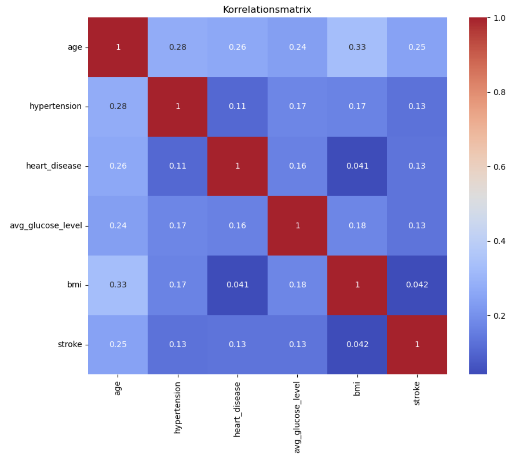

# Schlaganfall-Risiko – Vorhersage mit Machine Learning

## Projektüberblick
Dieses Projekt untersucht das Schlaganfall-Risiko von Patient*innen anhand eines Kaggle-Datensatzes.  
Ziel ist die Entwicklung eines Frühwarnsystems, das Schlaganfälle möglichst zuverlässig erkennt.  
Fokus liegt auf einem hohen **Recall** (wenig übersehene Schlaganfälle), auch wenn dies mehr False Positives (Fehlalarme) bedeutet.

- **Hauptziel**: Recall maximieren (≥ 0.85), um **kein Risiko zu übersehen**.  
- **False Positives** sind akzeptabel, da sie nur zu weiteren ärztlichen Abklärungen führen.  
- **Nutzen**: Unterstützung von Prävention und Früherkennung

- Ausführliche Projektdokumentation: [README_detail.md](docs/README_detail.md)
---

## Daten
- Kaggle-Dataset: *Healthcare Dataset Stroke Data* (Patientendaten aus Bangladesh, 5.110 Einträge), Quelle: [Kaggle](https://www.kaggle.com/datasets/fedesoriano/stroke-prediction-dataset)
- Features: Alter, Geschlecht, Blutdruck, Herzkrankheiten, Glukosespiegel, BMI, Raucherstatus, Wohn- & Arbeitsumfeld.  
- Zielvariable: `stroke` (0 = kein Schlaganfall, 1 = Schlaganfall).  
- Klassenverteilung: **95 % keine Schlaganfälle, 5 % Schlaganfälle** → stark unausgeglichen.  

---

## Projektstruktur
```
notebooks/
├── 01_Schlaganfallrisiko_EDA.ipynb # Laden, Bereinigung, Explorative Datenanalyse
├── 02_Schlaganfallrisiko_ML.ipynb # Training und Vergleich mehrerer ML-Algorithmen 
├── 03_Schlaganfallrisiko_LogisticReg.ipynb # Fokus auf Logistische Regression: Hyperparameter-Tuning, Koeffizienten & Odds Ratios, Polynomiale Features
data/ # (nicht im Repo) - Daten von [Kaggle](https://www.kaggle.com/datasets/fedesoriano/stroke-prediction-dataset)
Docs/README_detail.md # Ausführliche Projektdokumentation
visuals/ # Plots
requirements.txt # benötigte Python-Bibliotheken
```

---

## Installation

1. Repository klonen:
   ```bash
   git clone https://github.com/InkenOk/Schlaganfallrisiko-Vorhersage-ML.git
   cd schlaganfallrisiko-vorhersage
   ```

2. Virtuelle Umgebung erstellen und aktivieren (optional, empfohlen):
   ```bash
   python -m venv venv
   source venv/bin/activate  # macOS/Linux
   venv\Scripts\activate   # Windows
   ```

3. Abhängigkeiten installieren:
   ```bash
   pip install -r requirements.txt
   ```
   
---

## Ergebnisse (Kurzfassung)

**EDA**
- Datensatz: 5.110 Personen, 12 Variablen, nur ~5 % Schlaganfälle → stark unausgewogen.  
- Alter: wichtigster Risikofaktor, deutlich erhöhtes Risiko ab 60 Jahren (Median der Schlaganfallfälle: 71).  
- Weitere Faktoren: Bluthochdruck, Herzkrankheiten, höherer BMI und Glukosespiegel zeigen erhöhtes Risiko.  
- Rauchen: „Formerly smoked“ mit höchster Schlaganfallrate.  
- Geschlecht, Wohnort, Beruf: nur geringe Unterschiede; Selbstständige stärker betroffen.  
- Korrelationen: Alter korreliert am stärksten mit Schlaganfall (r ≈ 0.25); andere Faktoren schwach bis moderat.  



**Machine Learning**

Vorgehen:
- Train-Test-Split (80/20, stratifiziert)  
- Imputation: fehlendes BMI → Median; „Unknown“ beim Raucherstatus → überwiegend „Never Smoked“  
- Encoding: OrdinalEncoder & OneHotEncoder  
- Umgang mit Imbalance: SMOTE & `class_weight="balanced"`  
- Modelle: Naive Bayes, Logistische Regression, KNN, Decision Tree, Random Forest, Neuronales Netz (MLP), SVM

**Bewertung:** Recall (wichtigste Metrik), Precision, F1, ROC-AUC  

**Ergebnisse (Kurzfassung):**  
- Logistische Regression: Recall 0.86 (beste Sensitivität, aber niedrige Precision ~0.11)  
- Random Forest & Decision Tree: Recall 0.78–0.80, etwas bessere F1-Werte  
- SVM & MLP: Recall ~0.80  
- Naive Bayes: Recall 0.74  
- KNN: schwächste Ergebnisse (Recall 0.60)  

**Fazit**
- **Beste Ergebnisse**: Logistische Regression mit Recall >85 %.  
- **Trade-off**: Niedrige Precision (viele False Positives), aber akzeptabel im medizinischen Kontext, da Schlaganfälle selten übersehen werden.  
- **Nutzen**: Modell identifiziert Risikoprofile (z. B. hohes Alter, Bluthochdruck, hoher BMI, erhöhter Blutzucker, Rauchen) und eignet sich als **präventives Frühwarnsystem**.  
- **Interpretation**: Viele False Positives markieren tatsächlich Personen mit erhöhtem Risiko → sinnvoll für Vorsorge-Apps oder klinische Anwendungen.  

---

## Lizenz

Dieses Projekt steht unter der MIT-Lizenz.

---

## Quellen

[Kaggle](https://www.kaggle.com/datasets/fedesoriano/stroke-prediction-dataset)
