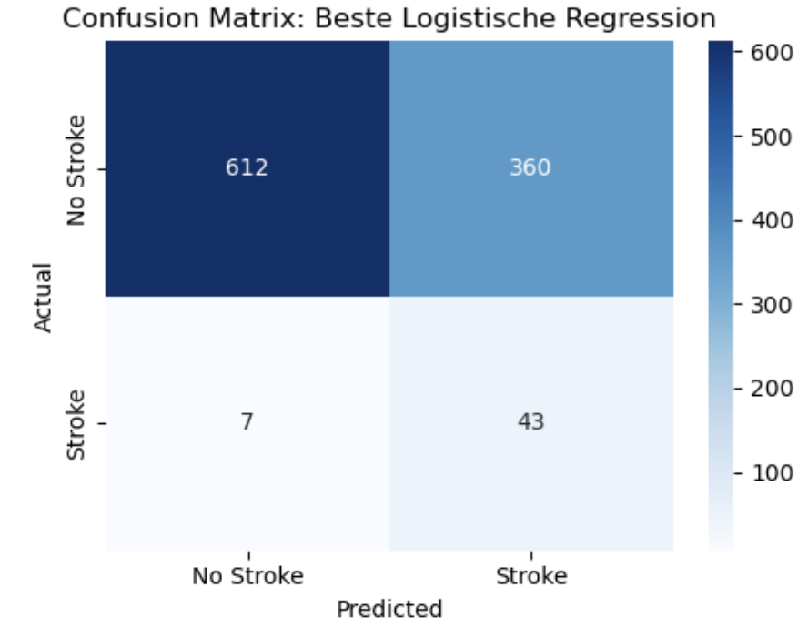

# Schlaganfall-Risiko – Detaillierte Projektdokumentation

## 1. Motivation
Schlaganfälle gehören zu den häufigsten Todesursachen weltweit. Dieses Projekt untersucht das Schlaganfall-Risiko von Patient*innen anhand eines Kaggle-Datensatzes.  
Ziel ist die Entwicklung eines Frühwarnsystems, das Schlaganfälle möglichst zuverlässig erkennt.    
Das Projekt zeigt, wie Machine Learning für ein solches Szenario genutzt werden kann.

**Hauptziel**: Recall maximieren (≥ 0.85), um **kein Risiko zu übersehen**. 
**Wichtig:** False Negatives (übersehene Schlaganfälle) müssen unbedingt minimiert werden.  
False Positives (Fehlalarme) sind dagegen akzeptabel, da sie „nur“ zu zusätzlicher medizinischer Abklärung führen.

**Ziel-Score**
| Metrik                          | Zielwert (realistisch)          | Begründung                                                                                                                     |
| ------------------------------- | ------------------------------- | ------------------------------------------------------------------------------------------------------------------------------ |
| **Recall** (True Positive Rate) | **≥ 0.85** *(am besten ≥ 0.90)* | Hauptziel: Möglichst **keinen Schlaganfall verpassen** (False Negatives minimieren).                                           |
| **Precision**                   | **≥ 0.10 – 0.20**               | Auch bei vielen False Positives sollte mindestens jede 10.–5. Warnung tatsächlich zutreffen (vertretbar in Vorsorgeszenarien) |
| **F1-Score**                    | **≥ 0.20 – 0.30**               | Balance zwischen Precision und Recall, nützlich als Gesamtüberblick.                                                           |
| **ROC-AUC** *(optional)*        | **≥ 0.80**                      | Gibt zusätzlich Auskunft über Trennschärfe, nützlich, aber nicht entscheidend, da Fokus auf Recall.                           |
---

## 2. Daten
- **Datensatz**: *Healthcare Dataset Stroke Data* (Patientendaten aus Bangladesh, 5.110 Einträge), Quelle: [Kaggle](https://www.kaggle.com/datasets/fedesoriano/stroke-prediction-dataset)
- **Features**: Alter, Geschlecht, Blutdruck, Herzkrankheiten, Glukosespiegel, BMI, Raucherstatus, Wohn- & Arbeitsumfeld.  
- **Zielvariable:** `stroke` (0 = kein Schlaganfall, 1 = Schlaganfall).  
- **Klassenverteilung:** Nur ~5 % Schlaganfälle → starkes Ungleichgewicht (class imbalance).  

**Beschreibung der Variablen:**
- `id`: Eindeutiger Patientenidentifikator
- `gender`: Geschlecht des Patienten („Male“, „Female“ oder „Other“)
- `age`: Alter des Patienten in Jahren
- `hypertension`: Bluthochdruck (0 = nein, 1 = ja)
- `heart_disease`: Herzkrankheit (0 = nein, 1 = ja)
- `ever_married`: (jemals) verheiratet oder nicht ("Yes"/"No")
- `work_type`: Berufstätigkeit: „children“, „Govt_job“, „Never_worked“, „Private“ oder „Self-employed“
- `Residence_type`: Wohnort („Rural“ oder „Urban“)
- `avg_glucose_level`: Durchschnittlicher Blutzuckerspiegel (mg/dl):
    - Normal: < 100 mg/dl
    - Prädiabetes: 100–126 mg/dl
    - Diabetes Typ II: > 126 mg/dl
    - Diabetes Typ I: > 200 mg/dl
- `bmi`: Body Mass Index
    - Untergewicht: < 18,5,
    - Normalgewicht: 18,5 bis < 25
    - Übergewicht: 25 bis < 30
    - Adipositas: >30
- `smoking_status`: Rauchverhalten („never smoked“, „formerly smoked“, „smokes“, „Unknown“)
- `stroke`(Zielvariable): Schlaganfall (0 = nein, 1 = ja)

---


## 3. Projektstruktur
```
notebooks/
├── 01_Schlaganfallrisiko_EDA.ipynb # Laden, Bereinigung, Explorative Datenanalyse
├── 02_Schlaganfallrisiko_ML.ipynb # Training und Vergleich mehrerer ML-Algorithmen 
├── 03_Schlaganfallrisiko_LogisticReg.ipynb # Fokus auf Logistische Regression: Hyperparameter-Tuning, Koeffizienten & Odds Ratios, Polynomiale Features
data/ # (nicht im Repo) - Daten verfügbar bei [Kaggle](https://www.kaggle.com/datasets/fedesoriano/stroke-prediction-dataset)
visuals/ # Plots
requirements.txt # benötigte Python-Bibliotheken

---

## 4. Installation

1. Repository klonen:
   ```bash
   git clone https://github.com/InkenOk/Schlaganfallrisiko-Vorhersage-ML.git
   cd schlaganfallrisiko-vorhersage

2. Virtuelle Umgebung erstellen und aktivieren (optional, empfohlen):
   ```bash
   python -m venv venv
   source venv/bin/activate  # macOS/Linux
   venv\Scripts\activate   # Windows
   ```

3. Abhängigkeiten installieren:
   ```bash
   pip install -r requirements.txt
   ```
   
---

## 5. Explorative Datenanalyse (01_Schlaganfallrisiko_EDA.ipynb)
**Zentrale Ergebnisse:**
- Alter: Risiko steigt stark ab 60 Jahren.  
- Hypertonie: Deutlich erhöhter Anteil an Schlaganfallpatienten.  
- Glukoselevel & BMI: Beide korrelieren mit Schlaganfallrisiko.  
- Rauchen: „Formerly smoked“ zeigt die höchste Schlaganfallrate.  
- Class imbalance bestätigt: 95 % „kein Schlaganfall“.  

**Univariate Analyse:**
- Der Datensatz umfasst 5110 Zeilen und 12 Spalten.
- Deskriptive Statistiken: 
	- `stroke`: Nur etwa 4.87 % der Personen im Datensatz hatten einen Schlaganfall. Dies ist ein starker Klassenunterschied, der bei der Modellierung berücksichtigt werden muss, da dies das Ergebnis negativ beeinflussen kann (z.B. mithilfe von SMOTE oder `class_weight="balanced"`).
	- `age`: Das Alter reicht von 0.08 bis 82 Jahren, mit einem Median von 45 Jahren. Der Datensatz umfasst somit auch Kleinkinder.
	- `hypertension` und `heart_disease`: Binäre Variablen (0 oder 1), mit einem relativ kleinen Anteil positiver Fälle, z. B. nur ~5.4 % der Personen haben eine Herzerkrankung und ~9.7 % der Personen haben Bluthochdruck.
	- `avg_glucose_level`: Zeigt einen mittleren Blutzuckerspiegel von 106.15 mg/dL, mit einem Maximum von 271.74, was auf Patienten mit Diabetes hindeutet.
	- `bmi`: Werte reichen von 10.3 bis 97.6, wobei der Mittelwert bei 28.89 liegt. Im Durchschnitt sind die Personen im Datensatz leicht übergewichtig. Es fehlen 201 BMI-Werte (n = 4909 vs. N = 5110).
	- `Residence_type` ist fast gleichverteilt zwischen „Urban“ (50.8 %) und „Rural“ (49.2 %).
	- `gender` ist mehrheitlich „Female“ (58.6 %) mit einem minimalen Anteil „Other“ (0.02 %).
	- `smoking_status` weist eine hohe Anzahl unbekannter Werte auf („Unknown“ mit 30.2 %). 15.44 % der Personen im Datensatz rauchen.
	- Bei `work_type` tritt die Kategorie „Private“ (57.2 %) am häufigsten auf, während „Never_worked“ mit 0.4 % sehr selten ist. 13.44 % (n = 687) Personen sind als `children` kategorisiert.  
	
- Bereinigung der Daten
	- `gender` = `'Other'` wird aufgrund der geringen Fallzahl (n=1) von den Analysen ausgeschlossen.

**Bivariate Analysen:**
- `age`: Schlaganfälle treten überwiegend bei älteren Personen auf (Median 71 Jahre, >50 % der Fälle ab 60 Jahren).
- `bmi`: Höheres Schlaganfallrisiko bei steigendem BMI, auch wenn Unterschiede zwischen Gruppen moderat sind.
- `avg_glucose_level`: Schlaganfallpatient*innen haben im Median etwas höhere Glukosewerte, Verteilung aber stark gestreut.
- `gender`: Männer leicht häufiger betroffen (4,7 %) als Frauen (4,4 %).
- `ever_married`: Höhere Rate bei Verheirateten (6,6 % vs. 1,7 %).
- `work_type`: Selbstständige am stärksten betroffen (7,9 %).
- `Residence_type`: Kaum Unterschied (4,5 % Land vs. 5,2 % Stadt).
- `smoking_status`: Höchstes Risiko bei „formerly smoked“ (7,9 %).
- Korrelationen: Alter zeigt den stärksten Zusammenhang mit Schlaganfall (r ≈ 0.25). BMI, Hypertonie, Herzerkrankung und Glukoselevel sind schwach bis moderat korreliert.


---

## 6. Machine Learning (02_Schlaganfallrisiko_ML.ipynb)
**Vorgehen:**
- Train-Test-Split mit Erhalt der Verteilung der Zielvariable (`stroke`) durch Stratifikation:
	- Trainingsdaten: 80% der Daten (4.087 Fälle)
	- Testdaten: 20% der Daten (1.022 Fälle)
- Imputation
	- - `bmi` = `NaN` wird durch den Median ersetzt.
	- `smoking_status` = `'Unknown'`: Die Kategorie `'Unknown'` beim Raucherstatus erschwerte die Analyse. Viele Einträge betrafen Kinder, daher wurden diese Fälle zu `'Never Smoked'` umkodiert. Für die übrigen „Unknown“-Werte wurde ein KNN-Imputer getestet, aber die Ergebnisse waren unzureichend. Schließlich wurden sie per Modus-Imputation ebenfalls auf `'Never Smoked'` gesetzt.
- Encoding:
	- `gender`, `ever_married` und `Residence_type` wurden mithilfe des `OrdinalEncoder` in numerische Werte überführt
	- `work_type` und `smoking_status` wurden mit dem `OneHotEncoder` kodiert, wobei jeweils die erste Kategorie gedroppt wurde, um Multikollinearität zu vermeiden.  
- Umgang mit Klassenungleichgewicht: SMOTE & `class_weight="balanced"`
- Skalierung der Daten, wenn nötig  
- Modelle: Naive Bayes, Logistische Regression, KNN, Decision Tree, Random Forest, Neuronale Netze, SVM

**Bewertungskriterien:**  
- Recall (wichtigste Metrik)  
- Precision  
- F1-Score  
- ROC-AUC  

**Ergebnisse der besten Modelle:**

| Modell                  | Recall (Test) | F1-Score (Test) | Precision (Test) | Accuracy (Test) |
|-------------------------|---------------|-----------------|------------------|-----------------|
| Logistische Regression  | 0.8600        | 0.1898          | 0.1067           | 0.6409          |
| Decision Tree           | 0.8000        | 0.2564          | 0.1527           | 0.7730          |
| SVM (RBF, balanced)     | 0.8000        | 0.2036          | 0.1166           | 0.6937          |
| Random Forest           | 0.7800        | 0.2500          | 0.1489           | 0.7710          |
| Neuronales Netz (MLP)   | 0.7800        | 0.2058          | 0.1185           | 0.7055          |
| Naive Bayes (GNB)       | 0.7400        | 0.1644          | 0.0925           | 0.6321          |
| KNN (k=10, dist. gew.)  | 0.6000        | 0.1600          | 0.0900           | 0.6900          |


| Modell                  | Wichtige Parameter / Einstellungen                                                                 |
|------------------------|----------------------------------------------------------------------------------------------------|
| Logistische Regression | `penalty='l1'`, `C=0.01`, `solver='liblinear'`, `class_weight='balanced'`, `scaler=MinMaxScaler()`       |
| Naive Bayes (GNB)       | `GaussianNB(priors=None, var_smoothing=1e-05)`, `SMOTE = Ja`                                          |
| K-Nearest Neighbors     | `n_neighbors=10`, `weights='distance'`, `metric='manhattan'`, `p=2`, `SMOTE = Ja`, `scaler=MinMax`     |
| Decision Tree           | `criterion='gini'`, `max_depth=8`, `max_leaf_nodes=30`, `class_weight='balanced'`, `random_state=42`   |
| Random Forest           | `n_estimators=200`, `max_depth=16`, `max_leaf_nodes=32`, `class_weight='balanced'`, `random_state=42`  |
| Support Vector Machine  | `kernel='rbf'`, `C=0.1`, `class_weight='balanced'`, `gamma='scale'`, `scaler=StandardScaler()`          |
| Neuronales Netz (MLP)   | `hidden_layer_sizes=(16,)`, `activation='tanh'`, `solver='sgd'`, `alpha=0.0001`, `max_iter=1000`, <br> `early_stopping=True`, `SMOTE=Ja`, `scaler=MinMaxScaler()` |

---

## 7. Logistische Regression im Detail (03_Schlaganfallrisiko_LogisticReg.ipynb)
**Hyperparameter-Tuning:**  

| Kategorie           | Optionen                                                 | Warum testen?                                                                                          |
| ------------------- | -------------------------------------------------------- | ---------------------------------------------------------------------------------------------------- |
| Balancing           | `SMOTE` oder `class_weight='balanced'`                   | Unterschiedliche Ansätze zur Behandlung von Klassenungleichgewicht, um bessere Modellleistung zu erzielen. |
| Skalierung          | Keine, `MinMaxScaler`, `StandardScaler`                  | Die Logistische Regression profitiert von unterschiedlichen Skalierungen für bessere Konvergenz und Performance. |
| Penalty             | `'l1'`, `'l2'`                                           | Verschiedene Regularisierungstypen für sparsames Modell (`l1`) oder glattere Gewichtungen (`l2`), wirken sich auf Feature-Auswahl und Overfitting aus. |
| Solver              | `'liblinear'` (einziger kompatibler für `'l1'` + `'l2'`) | Spezifischer Optimierer, der sowohl `l1` als auch `l2` Penalty unterstützt und gute Performance bei kleinen bis mittleren Datensätzen bietet. |
| Regularisierung `C` | `0.01`, `0.1`, `1`, `10`, `100`                          | Steuert Stärke der Regularisierung (kleines C = starke Regularisierung), beeinflusst Bias-Variance-Tradeoff und verhindert Overfitting. |

**Ergebnisse**
- Bestes Modell: `class_weight='balanced'`, `MinMaxScaler`, `l1`-Penalty und `C=0.01`
- True Negatives (TN) – 612 → Personen ohne Schlaganfall wurden korrekt als "kein Schlaganfall" klassifiziert.
- False Positives (FP) – 360 → Personen ohne Schlaganfall wurden fälschlicherweise als "Schlaganfall" klassifiziert. (→ hohe Zahl, was die Spezifität des Modells senkt)
- False Negatives (FN) – 7 → Personen mit Schlaganfall wurden fälschlicherweise als "kein Schlaganfall" klassifiziert. (→ relativ niedrig → gutes Recall-Verhalten)
- True Positives (TP) – 43 → Personen mit Schlaganfall wurden korrekt als "Schlaganfall" erkannt.



**Bewertung**
- Recall (Sensitivität) = TP / (TP + FN) = 43 / (43 + 7) = 0.86 → Das Modell erkennt 86 % aller tatsächlichen Schlaganfälle korrekt.
- Precision = TP / (TP + FP) = 43 / (43 + 360) ≈ 0.106 → Von allen vorhergesagten Schlaganfällen sind nur ca. 11 % tatsächlich korrekt (Viele Fehlalarme → niedrige Präzision)

**Koeffizienten & Odds Ratios:**  

| Merkmal (Feature)                      | Koeffizient | Odds Ratio | Einfluss         | Interpretation                                                                    |
| -------------------------------------- | ----------- | ---------- | ---------------- | --------------------------------------------------------------------------------- |
| `remainder__age`                       | **2.12**    | **8.29**   | ↑ stark positiv  | Alter hat den stärksten Einfluss auf das Schlaganfallrisiko.                      |
| `remainder__hypertension`              | **0.10**    | **1.11**   | ↑ leicht positiv | Bluthochdruck erhöht das Risiko geringfügig.                                      |
| `encoder__smoking_status_never smoked` | -0.22       | 0.80       | ↓ leicht negativ | Nichtraucher haben tendenziell ein geringeres Risiko (im Vergleich zur Referenz). |
| Alle anderen Merkmale                  | **0.00**    | 1.00       | – kein Einfluss  | Vom Modell als nicht relevant eingestuft und daher ignoriert.                      |


**Polynomiale Features:**  
- bei den Features `Alter` oder `BMI` liegt ein parabolischer Effekt vor → Hinzufügen von `age²` und `bmi²` 

| **Metrik**          | **LogReg (linear)** | **LogReg mit quadratischen Features** |
|---------------------|---------------------|----------------------------------------|
| Accuracy (Test)     | 0.6409              | 0.7084                                 |
| Precision (Test)    | 0.1067              | 0.1242                                 |
| Recall (Test)       | 0.8600              | 0.8200                                 |
| F1-Score (Test)     | 0.1898              | 0.2158                                 |
| ROC-AUC (Test)      | 0.8321              | 0.8373                                 |

- Das Modell zeigt insgesamt eine gute Leistung, insbesondere im Hinblick auf den Recall, der anzeigt, dass die meisten Schlaganfälle korrekt erkannt werden (Train Recall: 82,9 %, Test Recall: 82,0 %). Dies ist besonders wichtig, da das Ziel darin besteht, möglichst wenige Schlaganfälle zu übersehen.
- Die Precision ist zwar niedrig (ca. 12-13 %), was bedeutet, dass viele Vorhersagen von Schlaganfällen falsch positiv sind. Dieser Trade-off ist aber oft akzeptabel, da es bei medizinischen Vorhersagen wichtiger ist, keine echten Fälle zu verpassen.
- Die Einbeziehung quadratischer Features scheint sich positiv auf die Gesamtgenauigkeit (Accuracy) auszuwirken (Test Accuracy ca. 70,8 %) und ermöglicht dem Modell, komplexere Zusammenhänge zu erfassen.
- Der ROC-AUC-Wert (ca. 0.84) zeigt, dass das Modell eine gute Trennschärfe zwischen den Klassen besitzt.
- Insgesamt ist die Modellleistung jedoch etwas geringer → es werden weniger tatsächliche Schlaganfälle erkannt

---

## 8. Fazit
- Die besten Ergebnisse brachte die logistische Regression
- es konnten >85% der Fälle mit Schlaganfall vorhergesagt werden
- Alle Modelle zeigen eine niedrige Precision, d.h. es gibt viele False-Positive-Warnungen.
- Diese Fehlalarme betreffen jedoch Personen mit erhöhtem Risiko, z. B. höheres Alter, erhöhter Blutzuckerspiegel oder Vorerkrankungen.
- Das Modell erkennt somit relevante Risikoprofile, auch wenn (noch) kein Schlaganfall vorliegt.
- Dieser Trade-Off ist im medizinischen Kontext akzeptabel, da ein übersehener Schlaganfall gravierende Folgen hätte.
- Das Modell eignet sich daher gut als präventives Frühwarnsystem zur Identifikation potenziell gefährdeter Personen.
- Die wichtigsten Einflussfaktoren für das Schlaganfallrisiko im Datensatz waren, laut logistischer Regression mit l1-Regularisierung (Lasso), Alter und Bluthochdruck.

**Warum sind falsch-positive Warnungen plausibel?**
- Ein falsch-positives Ergebnis bedeutet: Das Modell sagt Schlaganfall vorher, aber die Person hatte keinen Schlaganfall im Datensatz. Trotzdem gibt es dafür oft gute Gründe aus Sicht des Modells:
	- Diese Personen haben Merkmalsmuster, die stark einem echten Schlaganfallfall ähneln, z. B.:
   		- hohes Alter
    		- Herz-Kreislauf-Erkrankungen (z. B. Bluthochdruck, Herzkrankheiten)
    		- hoher BMI
    		- erhöhte Blutzuckerwerte (avg_glucose_level)
    		- bestimmte Lebensgewohnheiten (z. B. Rauchen)
- Das Modell erkennt diese Risikomuster, auch wenn bei diesen Personen (noch) kein Schlaganfall aufgetreten ist.
- Interpretation:
	- Die falsch-positiven Warnungen sind meist nicht zufällig.
	- Sie können tatsächlich Personen mit einem erhöhten Risiko markieren, auch wenn in den Daten kein Ereignis dokumentiert ist.
- Damit liefert das Modell einen präventiven Nutzen: Es warnt bei Risikomustern, nicht nur bei gesicherten Fällen.
- Dies ist wichtig für die Praxis, z.B. einem realen Einsatz in einer Gesundheits-App oder Klinik:
    - Falsch-positive Personen könnten gezielt weiter untersucht oder überwacht werden.
    - Die Warnung könnte als Anstoß für eine genauere Diagnostik oder Prävention dienen.
    - In der Medizin ist das akzeptabel, wenn echte Fälle dadurch besser erkannt werden.

---

## Lizenz

Dieses Projekt steht unter der MIT-Lizenz.

---

## Quellen

[Kaggle](https://www.kaggle.com/datasets/fedesoriano/stroke-prediction-dataset)

